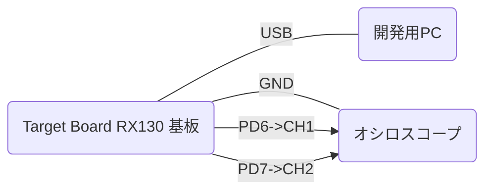

# GG for CCRX【 EMU+FIT 】セットアップ説明（工事中）

## ハードウェア環境

### 基板

この例ではルネサスエレクトロニクス株式会社の [Target Board for RX130](https://www.renesas.com/jp/ja/products/microcontrollers-microprocessors/rx-32-bit-performance-efficiency-mcus/rtk5rx1300c00000br-target-board-rx130) 基板を使用します。この基板にはデバッガ(E2 エミュレータ Lite 相当)の機能が搭載されています。開発用PCとUSBでつなぐだけで、電源供給およびプログラムの書込み/デバッグができます。

### 基板とPCの接続

基板とPCをUSBでつなぎます。  
基板の以下のピンをオシロスコープと接続します。
|ピン番号|用途|接続先|
|---|---|---|
|62|GND：信号GND|オシロスコープのGND|
|80|PD6：TP1出力ピン(基板LED0兼用)|オシロスコープのCH1|
|79|PD7：TP2出力ピン(基板LED1兼用)|オシロスコープのCH2|

#### オシロスコープ

GGのコンソール機能を使うだけであれば不要です。GGのTP機能を使ってプログラムのタイミング分析をするために使用します。この例では以下を使っています。  
[SIGLENT SDS 1104X-E](https://siglent.jp/sl/sds1000x-e-series/)  
CH1,CH2,GND以外はつなぎません。

## ソフトウェア環境

ルネサスエレクトロニクス株式会社の [統合開発環境 CS+](https://www.renesas.com/jp/ja/software-tool/cs) と [CC-RXコンパイラ](https://www.renesas.com/jp/ja/software-tool/cc-compiler-package-rx-family) を使います。  

|ツール|動作確認時のバージョン|
|---|---|
|統合開発環境 CS+ for CC|V8.07.00|
|Compiler Standard V3 for RX(CC-RX)|V3.04.00|

### ソフトウェア環境の構築手順【 EMU+FIT 】（工事中）

1. CS+ for CC でプロジェクトを作成（R5F51308AxFP、アプリケーション(CC-RX)、プロジェクト名=任意）
2. プロジェクトツリーのデバッグツールをRX E2 Liteに変更し、プロパティで・・
3. 接続用設定のメインクロックソースをHOCO(32MHz)にし
4. 内蔵フラッシュメモリ書き換え時のクロック操作を許可するを"はい"にする
5. スマートコンフィグレータ起動(RTOSはNone)
6. クロックでメインクロックのチェックはずし、HOCOクロックをチェックし
7. リセット後、HOCO発振が有効をチェックし
8. エラーなくなるようクロックの配線接続を変更
9. コンポーネントで CMT driver(r_cmt_rx) を追加
10. 保存して、コードの生成 を実行(セクション設定は"はい")
11. CS+に戻って、ビルドのリビルドプロジェクトを実行
12. 表示 - デバッグコンソール でデバッグコンソールを表示する
13. デバッグコンソール上で右クリックメニューでローカルエコーバックを無効にする
14. プロジェクトフォルダに GG_for_CCRX\src を srcフォルダごとコピー
15. プロジェクトツリーに src 配下の GG_for_CCRX_SCI.c と GG_main.c ファイルを登録
16. デバッグのデバッグツールへダウンロードを実行(対象OSなし)
17. デバッグの実行
18. シリアル端末(TeraTerm)でhelp[enter]と入力する

* プロジェクトフォルダ直下の .c/.h/.src ファイルは不要。(削除可)
* mdコマンドでメモリダンプ中に改行が混じることがあるようです。これは既知の問題です。すいません。(EMUだけ発生します)(原因はわかっていません)

#### NORTiのセットアップ

1. プロジェクトフォルダ直下にNORTiフォルダをコピー(INCLUDEとLIBの一部だけ利用)
2. ビルド・ツールプロパティのリンク・オプションの使用するライブラリ・ファイルに「%ActiveProjectDir%\NORTi\LIB\RX\RXC2\n4erxv2fl.lib」を追加
3. コンパイル・オプションの追加のインクルード・パスに「NORTi\INC」を追加

#### GGコンソールのセットアップ

1. プロジェクトツリーに src\gg 配下の 全.c ファイルを登録
2. プロジェクトツリーから プロジェクト名.c ファイルを外す
3. ビルドツールプロパティの・・
4. コンパイルオプションの追加のインクルードパスに src と src\gg を追加する

### 仕様変更のための修正箇所【 EMU+FIT 】

#### GG_main.c

* タイトル、初回プロンプト
* 初期コマンド登録

#### gg_sysdef.h

* TP機能の有効化(GG_TP_ENABLE)
* TP機能で使用する出力ポート
