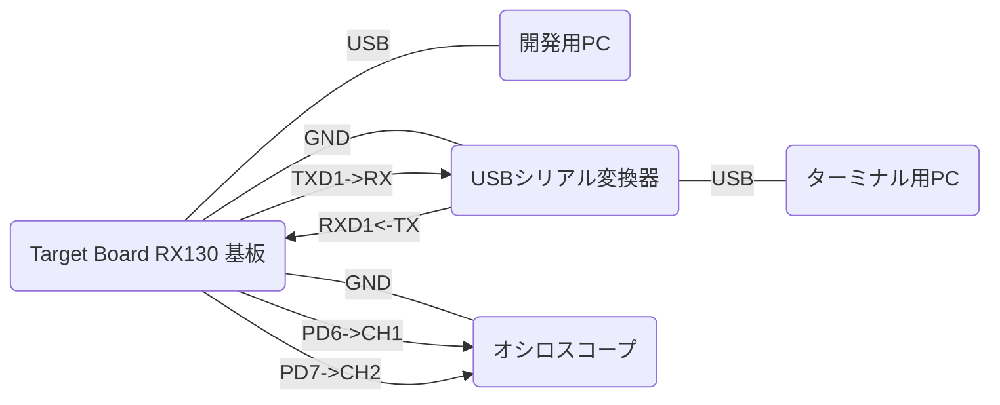

# GG for CCRX【 SCI 】セットアップ説明

## ハードウェア環境

### 基板

この例ではルネサスエレクトロニクス株式会社の [Target Board for RX130](https://www.renesas.com/jp/ja/products/microcontrollers-microprocessors/rx-32-bit-performance-efficiency-mcus/rtk5rx1300c00000br-target-board-rx130) 基板を使用します。この基板にはデバッガ(E2 エミュレータ Lite 相当)の機能が搭載されています。開発用PCとUSBでつなぐだけで、電源供給およびプログラムの書込み/デバッグができます。

### 基板と機器の接続

基板とPCをUSBでつなぎます。  
基板の以下のピンをその他の機器と接続します。
|ピン番号|用途|接続先|
|---|---|---|
|12|GND：信号GND|USBシリアル変換器のGND|
|20|RXD1：シリアルRXD入力|USBシリアル変換器のTX|
|22|TXD1：シリアルTXD出力|USBシリアル変換器のRX|
|62|GND：信号GND|オシロスコープのGND|
|80|PD6：TP1出力ピン(基板LED0兼用)|オシロスコープのCH1|
|79|PD7：TP2出力ピン(基板LED1兼用)|オシロスコープのCH2|

#### USBシリアル変換器

GGのコンソール機能の入出力(RXD/TXD)を開発用PCで扱うために、基板のシリアル信号をUSBに変換する「USBシリアル変換器」が必要です。この例では以下を使っています。  
[FTDI USBシリアル変換アダプター Rev.2](https://www.switch-science.com/catalog/2782/)  
RX,TX,GND以外はつなぎません。ジャンパは3.3V側です。

#### オシロスコープ

GGのコンソール機能を使うだけであれば不要です。GGのTP機能を使ってプログラムのタイミング分析をするために使用します。この例では以下を使っています。  
[SIGLENT SDS 1104X-E](https://siglent.jp/sl/sds1000x-e-series/)  
CH1,CH2,GND以外はつなぎません。

## ソフトウェア環境

ルネサスエレクトロニクス株式会社の [統合開発環境 CS+](https://www.renesas.com/jp/ja/software-tool/cs) と [CC-RXコンパイラ](https://www.renesas.com/jp/ja/software-tool/cc-compiler-package-rx-family) を使います。  

|ツール|動作確認時のバージョン|
|---|---|
|統合開発環境 CS+ for CC|V8.07.00|
|Compiler Standard V3 for RX(CC-RX)|V3.04.00|

### ソフトウェア環境の構築手順【 SCI 】

1. CS+ for CC でプロジェクトを作成（R5F51308AxFP、アプリケーション(CC-RX)、プロジェクト名=任意）
2. プロジェクトフォルダに GG_for_CCRX\src を srcフォルダごとコピー
3. プロジェクトツリーに src 配下の GG_for_CCRX_SCI.c と GG_main.c ファイルを登録
4. プロジェクトツリーに src\gg 配下の 全.c ファイルを登録
5. プロジェクトツリーから プロジェクト名.c ファイルを外す
6. プロジェクトツリーのデバッグツールをRX E2 Liteに変更し、プロパティで・・
7. 接続用設定のメインクロックソースをHOCO(32MHz)にし
8. 内蔵フラッシュメモリ書き換え時のクロック操作を許可するを"はい"にする
9. ビルドツールプロパティの・・
10. コンパイルオプションの追加のインクルードパスに src と src\gg を追加する
11. スマートコンフィグレータ起動(RTOSはNone)
12. クロックでメインクロックのチェックはずし、HOCOクロックをチェックし
13. リセット後、HOCO発振が有効をチェックし
14. エラーなくなるようクロックの配線接続を変更
15. コンポーネントで SCI driver(r_sci_rx) を追加
16. r_sci_rx の Use cercular buffer in ASYNC mode を Use にする
17. r_sci_rx の リソース(ずっと下の方) のSCI1、RXD1、TXD1をチェック
18. r_byte_q の Use disable interrupt to protect queue を Used にする
19. 保存して、コードの生成 を実行(セクション設定は"はい")
20. CS+に戻って、ビルドのリビルドプロジェクトを実行
21. デバッグのデバッグツールへダウンロードを実行(対象OSなし)
22. デバッグの実行
23. シリアル端末(TeraTerm)でhelp[enter]と入力する

プロジェクトフォルダ直下の .c/.h/.src ファイルは不要。(削除可)

### 仕様変更のための修正箇所【 SCI 】

#### GG_for_CCRX_SCI.c

* SCIチャンネル
* 通信仕様(スピード、パリティ他)

#### スマートコンフィグレータ

* SCI(TXD/RXD)の使用ピン

#### GG_main.c

* タイトル、初回プロンプト
* 初期コマンド登録

#### gg_sysdef.h

* TP機能の有効化(GG_TP_ENABLE)
* TP機能で使用する出力ポート
