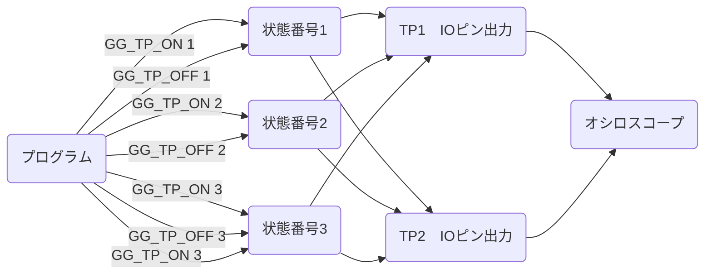

# GG for CCRX　機能説明

GG はシリアルコンソールを実現するための支援ライブラリです。コンソールを組み込むための補助的なツール（例えば printf()のような）を含みます。  

## コンソール

コマンドラインインターフェース（コンソールの基本機能）が実現できます。もちろん自分で作ったコマンドの追加もできます。

```text
** GG for CCRX **
>help
        help [cmd..]                  : command help
-- memory command --
          md [addr [alen]]            : mem dump
          ms addr data..              : mem set
          mf addr alen data           : mem fill
-- TP command --
          tp [#1 [#2]]                : TP(test point) select
>md 0x1000 0x30
00001000  F0 0D F8 FF A4 0E 00 00  23 17 F8 FF 00 0E F8 FF  ........ #.......
00001010  49 0D F8 FF 04 0E F8 FF  C8 0E F8 FF DA 0E F8 FF  I....... ........
00001020  00 01 00 00 64 0E F8 FF  70 0E F8 FF 7C 0E F8 FF  ....d... p...|...
>
```

### 通信仕様

* 3種類のシリアル通信(EMU/SCI/SIM)
* エコーバックはGGが出す（端末でキーを打てば打ったキーが表示されます）
* CR(\r)またはLF(\n)でコマンド実行

### 定義済みコマンド

* `help` コマンド一覧の表示
* `md` メモリダンプ
* `ms` メモリセット
* `mf` メモリフィル（ブロックセット）
* `tp` TP(テストポイント)の状態番号の表示と変更

### コマンドの追加方法

自分で作ったコマンドを追加できます。コマンド実装部（サブルーチン）にはコマンドラインのパラメータが argc と argv で渡されます。C言語の参考書や解説に「コマンドライン引数」を使ったmain()プログラムの例があると思います。これと同じですので参考にしてください。  
コマンド実装部（サブルーチン）は「コマンド登録」をすることでコマンドラインインタフェース（コマンド受付機能）が認識するコマンドになります。

#### コマンド実装部（サブルーチン）の例

```c
int C_test1(int argc, char **argv)
{
  int i;
  gg_printf("argc=%d\n", argc);
  for (i=0; i<argc; i++) {
    long x = 0;
    if (isDigit(argv[i][0])) x = gg_asc2int(argv[i]);
    gg_printf("argv[%2d] %-16s (0x%08lX,%ld)\n", i, argv[i], x, x);
  }
  return 0;
}
```

#### コマンド登録の例

```c
  // Register with console command (you can add more and more in this way)
  GG_CON_CMDMRK("-- Example of original command registration --");     // helpで一覧表示するときの区切り行
  GG_CON_CMDADD(C_test1, "test1", "[...]", "Display command line arguments when executing this command" );  // コマンドの登録(1行で1コマンド)
  // [1]コマンド実装部(サブルーチン),[2]コマンド文字列,[3]help(パラメータ部),[4]help(説明部)
```

### コマンドラインインターフェースなしでコンソールを使う方法

メインループ中でgg_con_Check()をコールしなくすることで、
コマンドラインインターフェース（コマンド受付機能）を使わないで、printf() のようなコンソールの出力機能だけ使うこともできます。  

```c
void main(void)
{

    gg_start("** GG for CCRX **\n");   // Start processing GG for CCRX
//  gg_con_RegistMemCMD();              // メモリ系コマンド登録 **削除**
    gg_printf("【コマンドラインインターフェースなしのデモ】\n");
    while(1) {
    //  gg_con_Check();                 // console processing (returns immediately if nothing is done) **削除**
    //  その他のメインループ処理
        subroutine_A();     // gg_printf() が使える
        subroutine_B();     // 同上
    }

}
```

### TP機能

通常のセットアップだとTP機能は無効になっています。  
gg_sysdef.hでGG_TP_ENABLEを定義すればTP機能が有効になります。  
TP機能を使えばプログラムの処理時間の測定や割込みやRTOSのタスク処理の状況確認ができるようになります。  

#### TP機能の仕組み



プログラムの調査したいポイントに状態番号コントロール（GG_TP_ON / GG_TP_OFF）を埋め込みます。プログラム実行中に状態番号コントロールを通過すると対応する状態番号がON/OFFします。  
オシロスコープにつながる2つのIOピン出力(TP1/TP2)は、状態番号のうち1つだけのON/OFFを出力します。(変化があればすぐ反応)
TP1/TP2それぞれがどの状態番号を出力するか、その設定の表示/変更を行うのがtpコマンドです。tpコマンドでTP1またはTP2に出力する状態番号を選択します。  
状態番号は何種類でも、またON/OFFは何カ所でも配置できますが、物理的な出力先はTP1とTP2の2つだけです。

```text
>tp
<TP status number(The specified status number appears in TP)>
TP1 =  -1 (-1=do nothing)
TP2 =  -1 (-1=do nothing)
>tp 1 10
<TP status number(The specified status number appears in TP)>
TP1 =   1 (-1=do nothing)
TP2 =  10 (-1=do nothing)
>tp 10 1
<TP status number(The specified status number appears in TP)>
TP1 =  10 (-1=do nothing)
TP2 =   1 (-1=do nothing)
```

## 利用できる関数/変数/定義

ヒープ(malloc)は使いません。  

|関数 / 変数|仕様|
|--|---|
|***GG.h***||
|int gg_start(const char \*title)|GG の開始|
|***gg_sysdef.h***||
|gg_tp_start(void)|TP機能スタート。出力ピン初期化とtpコマンドの登録|
|GG_TP_ON(number)|TPの状態番号をON|
|GG_TP_OFF(number)|TPの状態番号をOFF|
|GG_TP1|TP1に出力する状態番号(設定値)|
|GG_TP2|TP2に出力する状態番号(設定値)|
|GG_DI_ON()|割込み禁止|
|GG_DI_OFF()|割込み許可|
|GG_DI_BEGIN()|割込み禁止 区間開始|
|GG_DI_END()|割込み禁止 区間解除|
|***gg_uty.h***||
|int gg_GetC(void)|1文字入力 (-1 = 入力なし)|
|int gg_PutC(int c)|1文字出力|
|int gg_PutS(const char \*s)|文字列出力|
|int32_t gg_asc2int(char \*p)|文字列を整数に変換. '0x'で16進数と認識|
|int16_t gg_mbuf_init(GGT_MBUF \*mbuf, void\* buf, int max)|ミニバッファツール. 初期化|
|int16_t gg_mbuf_put(GGT_MBUF \*mbuf, int16_t d)|ミニバッファツール. 1バイト書込み|
|int16_t gg_mbuf_get(GGT_MBUF \*mbuf)|ミニバッファツール. 1バイト読出し|
|int16_t gg_mbuf_peek(GGT_MBUF \*mbuf, int16_t ix)|ミニバッファツール. のぞき見|
|gg_time_t|GGでのみ有効な秒単位での総時間。 開始点(0)は2000年1月1日|
|GGT_BCDTIME|日時の構造体(BCD)|
|GGT_TIME|日時の構造体(整数)|
|int gg_tim_bcd2dt(GGT_BCDTIME \*b, GGT_TIME \*t)|GGT_BCDTIMEからGGT_TIMEに変換|
|int gg_tim_dt2bcd(GGT_TIME \*t, GGT_BCDTIME \*b)|GGT_TIMEからGGT_BCDTIMEに変換|
|gg_time_t gg_tim_dt2tt(GGT_TIME \*t)|GGT_TIMEからgg_time_tに変換|
|gg_time_t gg_tim_YYMMDD2tt(int YY, int MM, int DD)|年月日からgg_time_tに変換|
|gg_time_t gg_tim_hhmmss2tt(int hh, int mm, int ss)|時分秒からgg_time_tに変換|
|int gg_tim_tt2dt(gg_time_t x, GGT_TIME \*t)|gg_time_tからGGT_TIMEに変換|
|int gg_tim_checkdt(GGT_TIME \*t)|日時のチェック|
|int gg_tim_repairdt(GGT_TIME \*t)|日時が異常ならそれなりの値に修正|
|int gg_tim_tt2week(gg_time_t x)|gg_time_tから曜日(0=日,1=月..6=土)に変換|
|***gg_printf.h***||
|int gg_vxprintf(int (\*putc)(int), const char \*fmt, va_list vlst)|putc()で出力するvprintf()|
|int gg_xprintf(int (\*putc)(int), const char \*fmt, ...)|putc()で出力するprintf()|
|int gg_printf(const char \*fmt, ...)|標準出力のprintf().%eは非実装|
|int gg_vsprintf(char \*buf, const char \*fmt, va_list vlst)|buf(メモリ)に出力するvsprintf()|
|int gg_sprintf(char \*buf, const char \*fmt, ...)|buf(メモリ)に出力するsprintf()|
|gg_printDATE(gg_time_t)|"YY/MM/DD"|
|gg_printTIME(gg_time_t)|"hh:mm:ss"|
|gg_printDT(gg_time_t)|"YY/MM/DD hh:mm:ss"|
|gg_printDTs(gg_time_t)|"YY/MM/DD hh:mm:ss "|
|***gg_console.h***||
|GG_CON_CMDADD(func, cmd, prm, help)|コンソールコマンド登録|
|GG_CON_CMDMRK(title)|コマンド一覧での区切り行登録|
|GG_CON|コンソール処理のワークエリア(内部で使用)|
|int gg_con_MonInit(void)|コンソールの初期化|
|char \*gg_con_prompt|プロンプト文字列. 初期値=">"|
|int gg_con_MonRePrompt(void)|プロンプトの再表示|
|int gg_con_MonPrompt(void)|プロンプトの表示 (内部で使用)|
|int gg_con_Check(void)|gg_GetC()で1文字取得しコンソールチェック処理をコール|
|int gg_con_MonCheck(int c)|コンソールチェック処理(c=-1のときは何もしない)|
|int gg_con_MonExec(char \*buf)|コマンドライン1行の処理(注:argv分割のためbufの中は破壊される)|
|int gg_con_MonBuf2Arg(char \*p, char \**argv, int argmax)|buf[]からargv解析(return = argc)(非リエントラント)|
|int gg_con_MonExecArg(int argc, char \**argv)|argv[0]をコマンド名として登録コマンドを検索し、見つかればコマンド実装部を実行|
|int gg_con_CmdInit(void)|コマンド登録リストの初期化|
|int gg_con_CmdAdd(GGT_CMD \*def)|コマンド登録リストに追加|
|int gg_con_CmdN(void)|コマンド登録数|
|int gg_con_CmdHelp(char \*cmd)|cmdのヘルプ表示|
|int gg_con_CmdHelpAll(void)|コマンド一覧の表示|
|int gg_con_RegistHelpCMD(void)|helpコマンド(定義済み)の登録|
|int gg_con_RegistMemCMD(void)|メモリ関連コマンド(定義済み)の登録|
